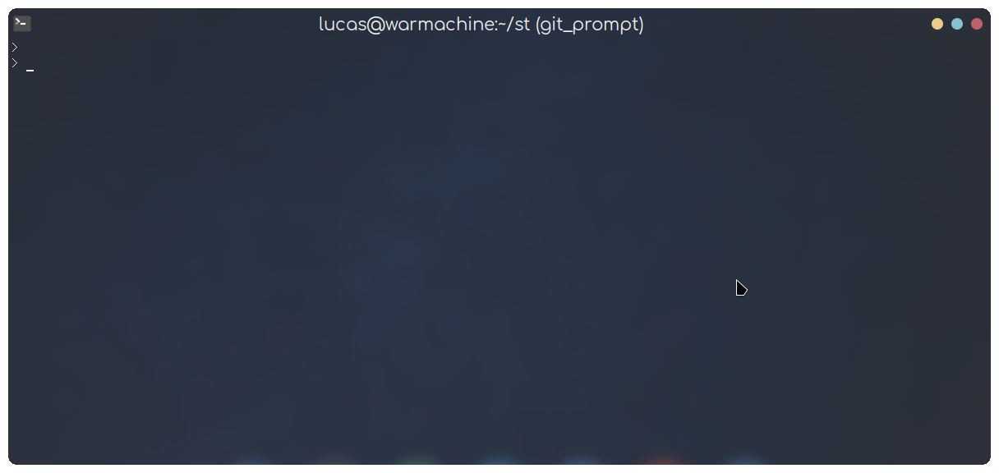
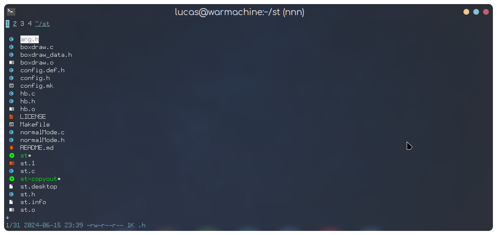
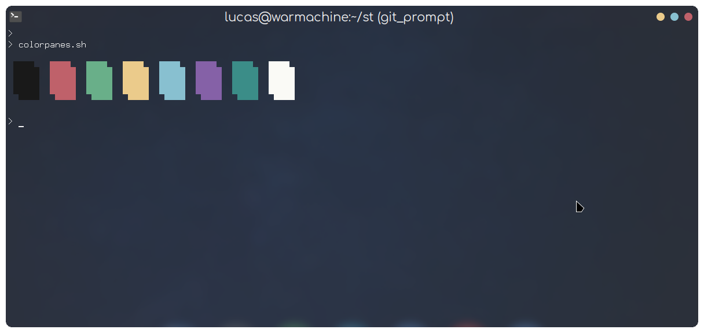
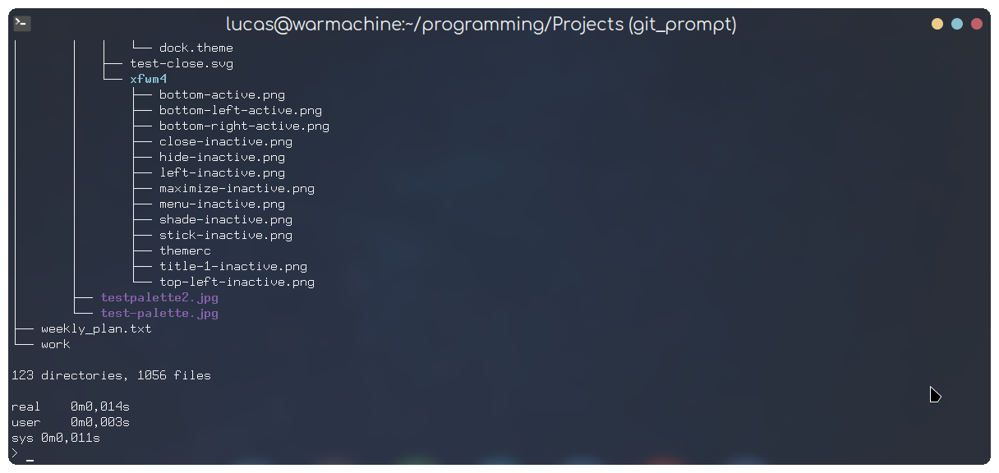

# St (Simple Terminal by Suckless)

My build with the River theme and the patches from st-snazzy + the workingdir patch. \
The configuration is tweaked a bit too, to fit the River theme automatically. \
So, if you are coming from my dotfiles repository this one should integrate with it seamlessly.

## Screenshots

 <br><br>
st-river with nnn file manager
 <br><br>
st-river with the colorpanes.sh script
 <br><br>
st-river with the tree command
 <br><br>

## Dependencies

```
# Void
xbps-install libXft-devel libX11-devel harfbuzz-devel libXext-devel libXrender-devel libXinerama-devel gd-devel

# Debian (and ubuntu probably)
apt install build-essential libxft-dev libharfbuzz-dev libgd-dev

# Arch
pacman -S gd

# Fedora (or Red-Hat based)
dnf install gd-devel libXft-devel

# SUSE (or openSUSE)
zypper in -t pattern devel_basis
zypper in gd-devel libXft-devel harfbuzz-devel

# Anywhere
## You need to install a **font-symbola**-like font, **libXft-bgra**, xorg-devel and the tools for building it
```

## Install

```
git clone https://github.com/Firespindash/st.git 
cd st 
(change the compiler if you cant use c99 to compile: sed -i 's/^#\ CC\ =\ c99/CC=gcc/' config.mk)
sudo make clean install 
xrdb merge xresources 
```

(note: put the xrdb merge command in your wm's autostart or similar)

## Fonts

- Install FontForge Raize Font and Monoid Nerd Font patch or any nerd font from [here](https://www.nerdfonts.com/font-downloads)

## Patches:

- Ligatures
- sixel (check sixel branch)
- scrollback
- Clipboard
- Alpha (Transparency)
- Boxdraw
- patch_column (doesn't cut text while resizing)
- font2
- right click paste
- st desktop entry
- newterm
- anygeometry
- xresources
- sync patch (Better draw timing to reduce flicker/tearing and improve animation smoothness)
- live reload (change colors/fonts on the fly)
- and more...
  <br>

If you do not like the patch selection I recommend using [st-flexipatch](https://github.com/bakkeby/st-flexipatch) to make
your own. I tried using it, but ended just keeping a similar selection to the original.

## Xresources live-reload

```
# make an alias for this command

alias rel="xrdb merge ~/.Xresources && kill -USR1 $(pidof st)"
```

## Default Keybindings<br>

<pre>
ctrl + shift + c        Copy  <br>
ctrl + shift + v        Paste <br>
right click on the terminal ( will paste the copied thing )

(Zoom)
alt  + comma            Zoom in <br>
alt  + .                Zoom out <br>
alt  + g                Reset Zoom<br>

(Transparency)
alt  + s                Increase Transparency<br>
alt  + a                Decrease Transparency<br>
alt  + m                Reset Transparency<br>

alt + k                 scroll down
alt + j                 scroll up

mod + shift + enter    open a new terminal with same cwd ( current working directory )
</pre>

you can change all of these in config.h
<br>

## Themes/Fonts used

- Xresources: [River](https://github.com/Firespindash/dotfiles)<br>
- Font: FontForge Raize Font + Monoid with Nerd icon font

# Credits

- [live-reload](https://github.com/nimaipatel/st)
- [patch_column](https://github.com/nimaipatel/st/blob/all/patches/7672445bab01cb4e861651dc540566ac22e25812.diff)
- From where this repository and distribution was based [st-snazzy](https://github.com/siduck/st)
